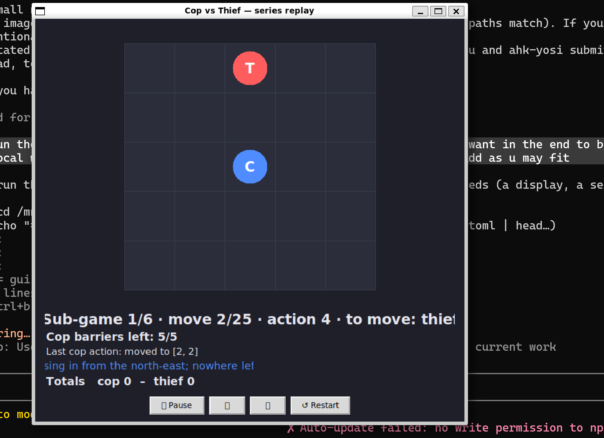
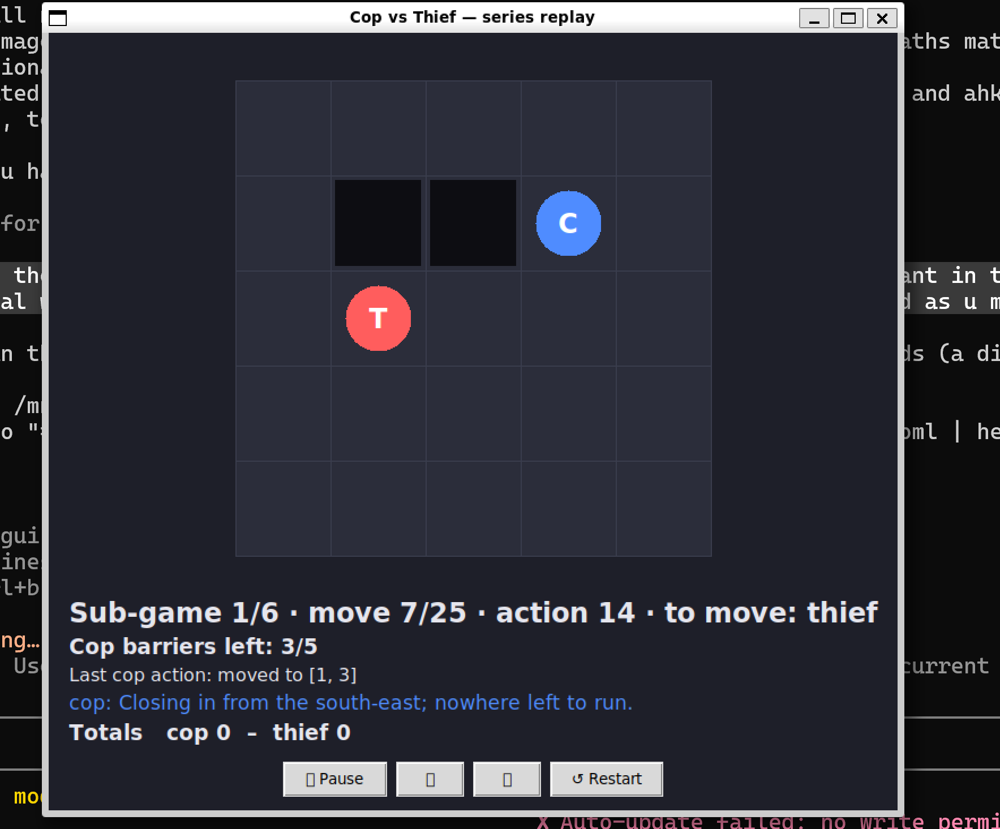
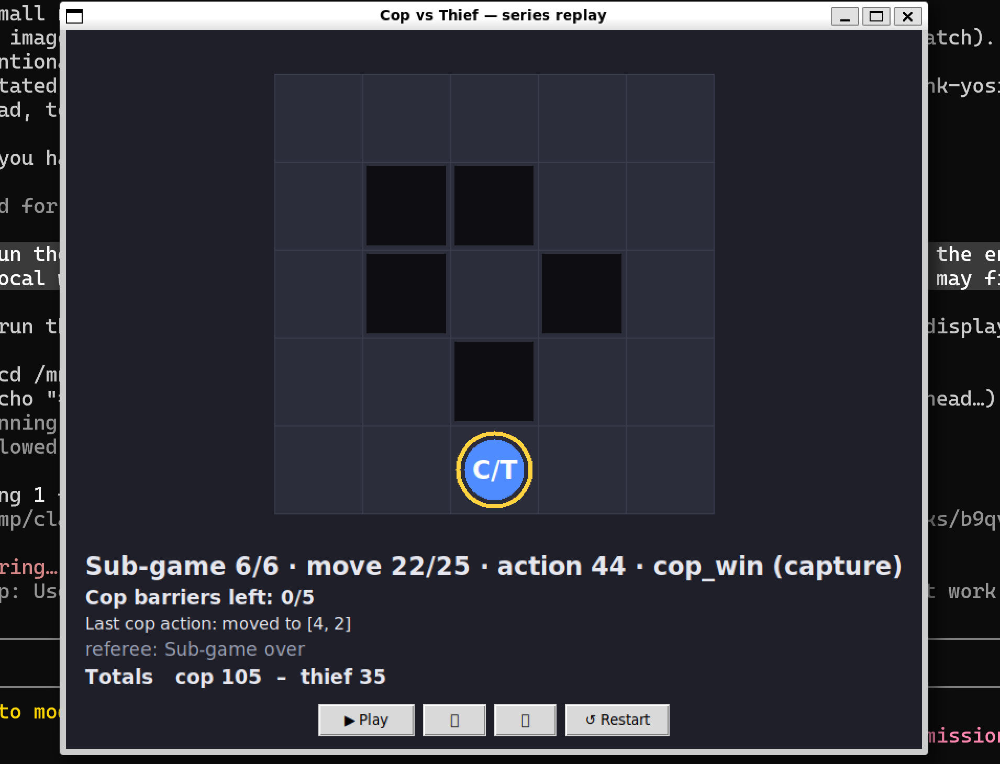
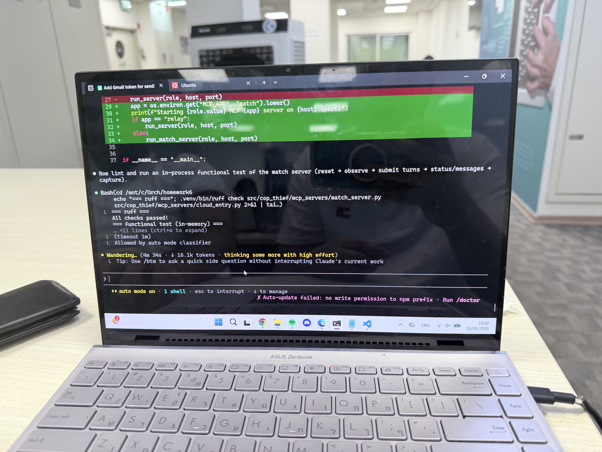

# Cop vs Thief — Dual AI Agents over MCP Servers

Homework 6, *AI Agent Orchestration* (Dr. Yoram Segal). A complete end-to-end
pipeline in which two autonomous AI agents — a **Cop** and a **Thief** — play a
partially observable chase on a grid, **communicate in free natural language**,
and are driven through **two separate MCP servers** by an orchestrator that runs
a full 6-sub-game series and **writes a JSON report to disk** — with **no manual
intervention** from start to final report.

> **Scope.** This repository delivers the **local section**: the full game,
> partial observability, barriers, the two local MCP servers, the orchestrator
> that drives the series through them, and the JSON report written under
> `results/reports/`. **Gmail delivery and cloud (HTTPS-tunnel) deployment are
> scaffolded but deferred — they are not part of the completed local section.**

> The graded value of this project is the **orchestration and communication**
> infrastructure, not the cleverness of the chase strategy (assignment §3, §14).

---

## Table of contents

1. [Project overview](#1-project-overview)
2. [Assignment requirements](#2-assignment-requirements)
3. [Architecture](#3-architecture)
4. [Dec-POMDP formal model](#4-dec-pomdp-formal-model)
5. [MCP server / client model](#5-mcp-server--client-model)
6. [Natural-language communication design](#6-natural-language-communication-design)
7. [Game rules](#7-game-rules)
8. [Scoring](#8-scoring)
9. [Configuration](#9-configuration)
10. [How to run locally](#10-how-to-run-locally)
11. [How to run the MCP servers](#11-how-to-run-the-mcp-servers)
12. [How to run the full 6-game series](#12-how-to-run-the-full-6-game-series)
13. [How Gmail reporting works](#13-how-gmail-reporting-works)
14. [Bonus round — inter-group match](#14-bonus-round--inter-group-match)
15. [Testing](#15-testing)
16. [Security notes](#16-security-notes)
17. [Evidence: log & run examples](#17-evidence-log--run-examples)
18. [Project layout](#18-project-layout)
19. [Configuration reference](#19-configuration-reference)
20. [Contribution guidelines](#20-contribution-guidelines)
21. [License & credits](#21-license--credits)

---

## 1. Project overview

Two independent agents chase each other on a configurable grid (5×5 by default).
Each agent sees only what is inside its **vision radius**; beyond it, it must
reason from the opponent's **natural-language messages**, which may be bluffs.
A central **orchestrator (the MCP client)** holds the LLM, drives the
conversation, and asks the authoritative **referee** to validate every action.
After 6 clean sub-games it builds a JSON report and writes it to
`results/reports/`. (Emailing that report via the Gmail API is scaffolded in
`orchestrator/gmail_sender.py` but **deferred** — see §13.)

The whole pipeline **runs offline and deterministically** out of the box: with
no API key it uses a built-in heuristic policy, so the game, logging, and report
all work without network or cost. Point it at Claude (`provider: anthropic`) and
the same agents are driven by an LLM instead.

## 2. Assignment requirements

| Requirement (assignment / shared rules) | Where it lives |
|---|---|
| 5×5 grid from config, `[row,col]`, 8-directional | `config/config.yaml`, `game/board.py` |
| 6 sub-games × ≤25 thief moves, thief first | `game/engine.py`, `orchestrator/runner.py` |
| Barriers: cop-only, on an adjacent empty cell, ≤5, impassable, illegal entry loses | `game/engine.py` |
| Capture = same cell, checked after every move, no swap-capture | `game/engine.py` |
| Partial observability, vision radius 2 (Chebyshev) | `game/observation.py` |
| Scoring 20/5 and 5/10 | `game/scoring.py` |
| Two separate MCP servers (cop, thief), LLM in the client | `mcp_servers/`, `orchestrator/llm_client.py` |
| Natural-language message + structured action per turn; action binds | `game/actions.py`, `agents/` |
| HTTPS + token auth via `Authorization` header | `security/`, `mcp_servers/server_app.py` |
| Full timestamped logs | `orchestrator/results.py` |
| Internal (§9.1) & bonus (§9.2) JSON reports | `orchestrator/report_builder.py` |
| Auto-email JSON to `rmisegal+uoh26b@gmail.com`, body = JSON only | `orchestrator/gmail_sender.py` |
| Config-driven, no hard-coding; secrets out of git | `config/config.yaml`, `.env.example` |
| Tests, ≤150 lines/file, Ruff-clean, `uv` | `tests/`, `pyproject.toml` |

## 3. Architecture

A layered design (per the software-guidelines SDK/layered model): thin
entrypoints over an orchestration layer, over the authoritative game core.

```
            ┌───────────────────────────── Orchestrator (MCP client) ─────────────────────────────┐
 CLI  ─────▶│  runner → builds observation → asks Agent for (message, action) → referee validates  │
 (main.py)  │     │                              │                                   │             │
            │     │                         llm_client (Claude)  ── or ──  heuristic strategy        │
            │     ▼                                                                  ▼              │
            │  report_builder → gmail_sender                                    JSONL turn log       │
            └───────────────────────────────────────┬──────────────────────────────────────────────┘
                                                     │ single source of truth
                                          ┌──────────▼──────────┐
                                          │  Referee (engine)   │  rules, capture, scoring
                                          │  game/ board state  │
                                          └──────────┬──────────┘
                  exposed over HTTPS as tools         │
            ┌──────────────────────┐         ┌────────▼─────────┐
            │  Cop MCP server      │         │ Thief MCP server │   observe() / submit_turn()
            │  (FastMCP, :8101)    │         │ (FastMCP, :8102) │   guarded by bearer token
            └──────────────────────┘         └──────────────────┘
```

- **Game core** (`game/`) is the only owner of the rules: board geometry,
  legal-action validation, capture detection, scoring, partial-observation
  construction. Pure Python, fully unit-tested, no I/O.
- **Agents** (`agents/`) turn a partial observation (+ the opponent's recent
  messages) into a `(message, action)`. An LLM does the reasoning when
  configured; otherwise an **intelligent heuristic** does (see below). Either way
  the agent **sanitises** its action so a malformed reply degrades to a safe move.

  The offline heuristics are built to *look like real agents*, scoring every legal
  move rather than moving at random (all weights live in `config.yaml`'s
  `strategy` block; `agents/geometry.py` provides barrier-aware BFS distances):
  - **Thief** (`agents/thief_policy.py`) scores each escape cell by immediate
    safety (never a cell the cop could capture next turn if a safer one exists),
    barrier-aware distance from the cop, future mobility (avoid dead-ends),
    corner/trap avoidance when the cop is near, breaking line of sight, and a
    one-step **lookahead** (how safe the cell still is after the cop's best reply).
    Out of sight it uses a *decaying memory* of where the cop was last seen — never
    the hidden true cell.
  - **Cop** (`agents/cop_policy.py`) captures when it can, otherwise chases on the
    BFS shortest path around barriers (last-seen memory / patrol when blind). It
    places a barrier only when a *simulated* candidate on the thief's own escape
    lane clears `cop_barrier_min_value` — never randomly, never every turn.
- **Orchestrator** (`orchestrator/`) runs the series, owns the **referee** (the
  single authoritative state), threads messages between agents, logs every turn,
  builds the report, and emails it.
- **MCP servers** (`mcp_servers/`) expose the referee's `observe`/`submit_turn`
  tools over HTTPS with token auth — the network boundary another team calls.
- **Security** (`security/`) issues and verifies bearer tokens.

## 4. Dec-POMDP formal model

The chase is a **Decentralized Partially Observable Markov Decision Process**
⟨ *n, S, {Aᵢ}, P, R, {Ωᵢ}, O, γ* ⟩:

| Symbol | Meaning in this game |
|---|---|
| **n** | `2` agents — cop (`i=1`) and thief (`i=2`). |
| **S** | State = (cop cell, thief cell, barrier set `B ⊆ cells`, side-to-move, thief-move count, barriers used). On an `R×C` grid, `\|S\|` is bounded by `(R·C)² · 2^{R·C} · …`. |
| **{Aᵢ}** | `A_thief` = the ≤8 king-moves to adjacent cells. `A_cop` = those moves **plus** "place a barrier on an adjacent empty cell" while budget remains (see the barrier note in §7). |
| **P** | Deterministic, turn-based transition (`game/engine.py`): apply the mover's action, then check capture/termination. Thief moves first, cop replies. |
| **R** | Terminal team reward (`game/scoring.py`): capture → cop `20`, thief `5`; escape → cop `5`, thief `10`. |
| **{Ωᵢ}** | Observation space per agent = (own cell, opponent cell *or* `hidden`, the subset of barriers within vision). |
| **O** | Deterministic observation function (`game/observation.py`): reveal the opponent and a barrier iff its Chebyshev distance ≤ `vision_radius`; otherwise hidden. The only ground truth an agent gets. |
| **γ** | Discount factor. The game is **episodic** with reward only at termination, so γ = 1 for scoring; the optional Q-learning baseline (assignment §8) uses γ = 0.9. |

Because each agent acts on its **own** local observation and the (possibly
deceptive) messages — never on the global state — this is genuinely
*decentralized* and *partially observable*, exactly the Dec-POMDP setting.

## 5. MCP server / client model

The key architectural rule (assignment §5.2 / §14): **the LLM is not hosted inside
the MCP server — and neither is the authoritative game state.** Each MCP server is
a thin per-agent boundary that exposes *tools only*; the **client (our
orchestrator)** holds the LLM **and** the single referee, and drives the whole
series through the servers' tools over HTTP.

- **MCP client** = `orchestrator/mcp_series.py` — owns the one authoritative
  `SubGameReferee`, computes each agent's partial observation, **decides
  client-side** (LLM or heuristic), and routes every turn through both servers.
  Run it with `cop-thief run --mcp` (start the two servers first). The server
  URLs come from `config.yaml` → `mcp.*` (`{COP,THIEF}_MCP_URL` override for the
  cloud HTTPS endpoints).
- **MCP servers** = `mcp_servers/cop_server.py`, `thief_server.py`, built on
  **FastMCP**, one per agent on its own localhost port. Each exposes tools only —
  no game logic, no LLM:
  - `health()` — liveness (no auth);
  - `set_context(observation, position)` — the client shares this agent's current
    partial observation and true cell;
  - `observe()` — the agent reads back its legal partial observation;
  - `submit_turn(message, action)` — the agent **sends + records** its
    natural-language message and chosen action;
  - `last_message()` — the opponent reads this agent's most recent message;
  - `verify_location(claim)` — mutual location verification (§5.1).
- Every tool except `health()` calls `_authorize()`, which checks the
  `Authorization: Bearer <token>` header (`security/auth.py`); with no token
  configured (local dev) auth is open.
- The outcome is always decided by the orchestrator's referee on the binding
  `action`, **never** by the (bluffable) `message`.

An in-process runner (`orchestrator/runner.py`, used by the GUI and by
`cop-thief run` *without* `--mcp`) plays the identical game without the network
for speed and determinism; `--mcp` runs the same logic through the live servers.
Technical Losses (transport failures) are retried, then the sub-game is voided
and re-run until 6 valid sub-games complete (§9).

## 6. Natural-language communication design

Each turn carries two things (SHARED_MATCH_RULES.md §2.2):

```json
{ "sub_game": 1, "move_number": 7, "role": "thief",
  "message": "free natural-language text (may bluff)",
  "action": { "type": "move|barrier", "to": [row, col] } }
```

- The **message** is the only thing an agent reveals beyond its move. It is free
  text and **may lie** — bluffing is part of the game.
- The **action** is what the referee validates and scores. *The outcome is
  decided by the action, never by the message text.*
- The orchestrator threads the **opponent's recent messages** into the next
  agent's prompt as the only out-of-vision information, so deception actually
  matters when the opponent is outside the vision radius.
- Heuristic agents generate templated headings and sometimes broadcast a false
  one (`agents/messages.py`); LLM agents write and interpret messages freely
  (`orchestrator/prompts.py`).

**The architecture challenge (assignment §11).** The agents coordinate over
**free natural language with no predefined protocol**, which raises two problems
we design around:

- **Linguistic ambiguity & deception.** A message can be vague or an outright
  bluff. We never let language drive state: every turn binds a **structured
  `action`** that the referee validates and scores, while the free-text `message`
  is only an *advisory signal* the receiving agent's LLM interprets to update its
  belief about the hidden opponent. A lie can mislead the opponent's *guess* but
  can never change the true board — so the protocol stays robust without being
  rigid.
- **Mutual identity & authenticity.** Servers require a per-request
  `Authorization: Bearer` token (constant-time check), so each side talks only to
  the authenticated peer; and because the cop-side referee is the single source
  of truth for positions, an agent can't spoof its location — `get_match_status`
  / `validate_action` confirm the real state. Identity and location are thus
  asserted by the servers, not by trust in the message text.

## 7. Game rules

- **Grid**: `R×C` (default 5×5) from config; origin `[0,0]` top-left, `[row,col]`.
- **Movement**: one cell per turn, 8-directional (diagonals); 4-directional is a
  config switch.
- **Turns**: thief first, then cop, repeating. A sub-game lasts ≤ 25 **thief**
  moves; the thief wins if it finishes its 25th move uncaught (the cop's reply is
  its last chance).
- **Barriers**: instead of moving, the **cop** may drop a barrier on an
  **adjacent empty cell** — any of the 8 neighbours that is on the board, not the
  cop's own cell, not the thief's cell, and not already a barrier (≤ 5/sub-game).
  The cop does not move that turn. The cell becomes impassable for both; the thief
  cannot place barriers. If no valid neighbour exists, the barrier action is
  unavailable that turn. **Stepping into a barrier loses** the sub-game.

  > **Documented design decision — deviation from assignment §4.3, lecturer-confirmed.**
  > The assignment text specifies the barrier is placed on the cop's **own current
  > cell**. This project instead places it on an **adjacent empty cell**, which the
  > lecturer confirmed, so the barrier is a usable tool for cutting off the thief's
  > escape routes rather than only the cell the cop is leaving. The rule is stated
  > in [`docs/SHARED_MATCH_RULES.md` §2.4](docs/SHARED_MATCH_RULES.md) and validated
  > in `game/engine.py::_validate_barrier`.
- **Capture**: cop and thief on the **same cell**, checked after every move. A
  pass-through swap is not a capture (turns are sequential, so this is automatic).
- **Win**: cop wins on capture; thief wins by surviving.
- **Start**: seeded-random per sub-game; cop and thief never share a cell and,
  when the grid allows, start beyond each other's vision radius.

## 8. Scoring

| Result | Cop | Thief |
|---|---|---|
| Cop wins (capture) | **20** | 5 |
| Thief wins (escape) | 5 | **10** |

Series totals accumulate over the 6 sub-games (max 90, min 30 for one team).
Bonus claim (inter-group): higher series total → 10, lower → 7, tie → 5 each;
the final bonus is the average over all series.

## 9. Configuration

Every tunable lives in [`config/config.yaml`](config/config.yaml) — nothing is
hard-coded (assignment §10). Secrets never live there; they come from `.env`
(see [`.env.example`](.env.example)). See the [full reference](#18-configuration-reference).

## 10. How to run locally

Prerequisites: [`uv`](https://docs.astral.sh/uv/) and Python ≥ 3.11.

```bash
uv sync --extra dev          # create the venv and install everything
cp .env.example .env         # optional; fill in keys/tokens as needed

# Play the full 6-sub-game series offline (heuristic agents, no API key):
uv run cop-thief run
```

This prints a per-sub-game summary and totals, writes a timestamped JSON report
to `results/reports/`, and a full turn log to `results/logs/`.

To drive the agents with Claude instead of the heuristic:

```bash
export ANTHROPIC_API_KEY=sk-ant-...     # or put it in .env
uv run cop-thief run --provider anthropic
```

### Graphical UI (Tkinter, no extra dependencies)

```bash
uv run cop-thief-gui          # or: uv run python -m cop_thief.gui
```

Opens a window that animates the full series — cop (blue), thief (red), barriers,
the score, and each turn's natural-language message (bluffs included) — with
**Play / step / restart** controls. Uses the offline heuristic agents so it stays
responsive. (Needs Tk, which ships with the standard python.org build; on a
Homebrew Python install it via `brew install python-tk`.)

The replay GUI showing a local game from opening to capture — these screenshots,
together with the cloud-match CLI logs in [§14](#14-bonus-round--inter-group-match),
are the **visualization & proof** the assignment asks for (§11):







### Running on Windows

The project is pure Python and fully cross-platform — no code changes needed.
**Do not copy a `.venv` made on another OS** (venvs hold platform-specific
binaries); move the source and rebuild:

```powershell
winget install astral-sh.uv          # install uv (once)
Remove-Item -Recurse -Force .venv    # only if a foreign .venv was copied in
uv sync --extra dev                  # uv fetches Python 3.11+ and the deps
uv run cop-thief run                 # same commands as macOS/Linux
uv run cop-thief-gui                 # Tk ships with the Windows Python — no extra install
```

`uv.lock` resolves the correct Windows wheels, console scripts become `.exe`
shims, and all paths use `pathlib`, so behaviour matches macOS/Linux.

## 11. How to run the MCP servers

The two servers are separate processes (assignment §6, stage 1 — localhost):

```bash
uv run python -m cop_thief.mcp_servers.cop_server     # binds 127.0.0.1:8101
uv run python -m cop_thief.mcp_servers.thief_server   # binds 127.0.0.1:8102
```

Bind host/port come from `config.yaml` → `mcp.{cop,thief}` (overridable by
`COP_SERVER_HOST/PORT` and `THIEF_SERVER_HOST/PORT`). Set `MCP_AUTH_TOKEN` to
require a bearer token on every tool except `health()`. For the cloud stage,
front each server with TLS (ngrok Traffic Policy / Localtonet / Nginx) so the
four MCP URLs are **HTTPS**, and exchange tokens out of band.

## 12. How to run the full 6-game series

```bash
uv run cop-thief run            # 6 sub-games in-process, report, no email
uv run cop-thief run --mcp      # drive the series THROUGH the two running servers
uv run cop-thief run --email    # also email the JSON report (Gmail API)
uv run cop-thief run --no-log   # skip the JSONL turn log
```

`--mcp` is the assignment's target topology (§6 stage 1): start both servers
(§11) in separate terminals, then run the client — every turn flows over MCP.
The number of sub-games, grid size, scoring, vision radius, seed, etc. are all
read from `config.yaml`.

## 13. How Gmail reporting works

> The local series **writes the JSON report to `results/reports/`** and only
> emails when you pass `--email`; the **bonus match (§14) emails automatically**
> when it ends. Both use the Gmail path below (`orchestrator/gmail_sender.py`)
> after the one-time OAuth setup.

Following the course Google API guide:

1. In Google Cloud Console create an **OAuth client ID** of type **Desktop app**,
   enable the **Gmail API**, add your address as a **Test user**, and download
   `credentials.json` into the project root (git-ignored).
2. First send opens a browser consent screen and caches a refreshable
   `token.json` (also git-ignored) — token-based auth, no password.
3. `cop-thief run --email` sends the report to `rmisegal+uoh26b@gmail.com`. The
   email **body is exactly the JSON report, with no extra text**, so the grading
   harness can parse it. Recipient and file paths come from `.env`.

## 14. Bonus round — inter-group match

For the §12 bonus, two teams play a live 6-sub-game match across **four** MCP
servers (two per team). We are **amireman** (group_2); our opponent is
**ahk-yosi** (group_1). The full contract, handshake, and per-sub-game reset
protocol are in [`docs/MATCH_PEER.md`](docs/MATCH_PEER.md).

**Two synced referees.** Each sub-game has an authoritative referee (the cop
side's cop server) and a mirror (the thief side's thief server); every move is
**dual-submitted to both** so the two engines stay byte-identical. Roles swap at
the halfway point:

- **Sub-games 1–3:** ahk-yosi = Cop, amireman = Thief (their cop server referees).
- **Sub-games 4–6:** amireman = Cop, ahk-yosi = Thief (our cop server referees).

Each team resets only the server it owns, and the thief side adopts the cop
side's start cells. Our two servers are deployed on **Google Cloud Run** (HTTPS,
bearer-token auth) and expose the agreed 8-tool contract
(`mcp_servers/match_server.py`): `health_check, reset, get_observation,
validate_action, submit_turn, get_match_status, receive_message, get_messages`.

**Run our side of the match** (both teams launch simultaneously):

```bash
uv run cop-thief match                        # LLM agents; plays 6 sub-games, builds + emails the §9.2 report
uv run cop-thief match --provider heuristic   # free/fast dry run, no API calls
uv run cop-thief match --no-email             # skip the auto-email
```

When the six sub-games finish, the driver writes the **§9.2 `bonus_game`** report
to `results/reports/` and emails it (body = compact JSON only). Both teams email
the **byte-identical** report to the grader with `mutual_agreement: true` (§12.2).

**Result.** ahk-yosi **80**, amireman **60** — series winner **ahk-yosi**; bonus
claim ahk-yosi 10 / amireman 7.




## 15. Testing

```bash
uv run pytest                                   # run the suite
uv run pytest --cov=cop_thief --cov-report=term-missing   # with coverage
uv run ruff check src tests                     # lint (zero warnings)
```

Tests cover movement, barriers (placement, blocking, budget decrease/reset),
capture/engine, scoring, partial observation, barrier-aware geometry (BFS around
walls), the heuristic policies (thief immediate-safety / mobility / last-seen
memory / lookahead, value-gated cop barriers, no hidden-opponent leak), a balance
sanity guard, illegal actions, start positions, agent sanitisation/fallback, the
report schemas (including the §9.2 `bonus_game` shape), doc hygiene, and the
CLI — **111 tests** (coverage target ≥ 85 % met). The core game logic and
geometry are at 100 %.

## 16. Security notes

- **No secrets in git.** `.env`, `credentials.json`, `token.json`, and keys are
  git-ignored; only `.env.example` ships.
- **Token auth, constant-time.** MCP tools require `Authorization: Bearer <token>`
  verified with `hmac.compare_digest` (`security/auth.py`); tokens are
  high-entropy and revocable (`security/tokens.py`).
- **LLM lives in the client only**, behind outbound calls; the MCP servers carry
  no keys (assignment §7.3 hybrid model). Front them with TLS for HTTPS.
- **Defensive validation.** The referee rejects every illegal action; agents
  additionally self-sanitise so a bad LLM reply never crashes a game.
- **Rate limiting / retries** are configured (`match.rate_limit_per_min`,
  `match.max_retries`) to stay friendly to a peer team's API gateway.

## 17. Evidence: log & run examples

Console output of a full offline series (deterministic, seed 42) — the cop and
thief each win some sub-games, and the cop spends barriers along the way:

```
  sub-game 1: cop_win   (capture)  in 3 moves  -> {'cop': 20, 'thief': 5}
  sub-game 2: cop_win   (capture)  in 5 moves  -> {'cop': 20, 'thief': 5}
  sub-game 3: cop_win   (capture)  in 2 moves  -> {'cop': 20, 'thief': 5}
  sub-game 4: thief_win (survived) in 25 moves -> {'cop': 5, 'thief': 10}
  sub-game 5: thief_win (survived) in 25 moves -> {'cop': 5, 'thief': 10}
  sub-game 6: thief_win (survived) in 25 moves -> {'cop': 5, 'thief': 10}
Totals: cop=75 thief=45
Report written to results/reports/report_20260624T062649Z.json
```

A turn from the JSONL log showing the **bluff channel** (the message says
"south" while the action moves north-west — the result follows the action):

```json
{"event":"turn","timestamp":"2026-06-22T10:20:19Z","sub_game":1,"move_number":2,
 "role":"thief","message":"Breaking south — try to keep up.",
 "action":{"type":"move","to":[0,2]},"legal":true,"validation":"ok",
 "cop":[3,1],"thief":[0,2],"barriers":[],"result":"in_progress"}
```

And a **cop placing a barrier** on an adjacent cell (it does not move that turn,
and the new barrier shows up in the turn's `barriers` list):

```json
{"event":"turn","timestamp":"2026-06-24T07:18:15Z","sub_game":2,"move_number":1,
 "role":"cop","message":"Sealing this corridor — you won't get through here.",
 "action":{"type":"barrier","to":[1,1]},"legal":true,"validation":"ok",
 "cop":[0,0],"thief":[2,2],"barriers":[[1,1]],"result":"in_progress"}
```

> **Move counting.** `move_number` is the **assignment-level move** (§2.8): the
> thief's k-th move and the cop's reply to it share move `k`, so it runs `1..25`
> and never exceeds `max_moves`. The GUI additionally shows a raw **action** index
> (`1..50`) for step-by-step transparency — that larger number is *not* the
> assignment move.

Put GUI/CLI screenshots under `results/screenshots/` for the cloud run.

## 18. Project layout

```
cop-thief/
  config/config.yaml          all game parameters (no hard-coding)
  docs/                       PRD, PLAN, TODO, ARCHITECTURE, PROMPTS, REPORT_SCHEMA
  src/cop_thief/
    game/                     board, actions, state, observation, scoring, engine, setup
    agents/                   base/cop/thief agents, geometry, tuning,
                              thief_policy, cop_policy, strategies, messages
    gui/                      Tkinter replay: driver, board_view, app
    mcp_servers/              cop_server, thief_server, shared server_app
    orchestrator/             runner, referee, llm_client, prompts, results,
                              report_builder, gmail_sender
    security/                 auth, tokens
    config.py, main.py
  tests/                      movement, barriers, scoring, observation, engine,
                              report schema, agents, config, CLI
  results/                    logs/ reports/ screenshots/
  pyproject.toml  uv.lock  .env.example  .gitignore
```

## 19. Configuration reference

| Key | Default | Meaning |
|---|---|---|
| `game.grid_size` | `[5, 5]` | grid rows × cols |
| `game.max_moves` | `25` | max thief moves per sub-game |
| `game.num_games` | `6` | sub-games per series |
| `game.max_barriers` | `5` | barriers the cop may place |
| `game.movement_directions` | `8` | `8` = diagonals, `4` = orthogonal |
| `scoring.cop_win / thief_win / cop_loss / thief_loss` | `20 / 10 / 5 / 5` | per-result scores |
| `observation.vision_radius` | `2` | Chebyshev sight radius |
| `observation.start_outside_vision` | `true` | start agents beyond each other's sight |
| `referee.owner` | `cop` | which side owns authoritative state |
| `turn.timeout_seconds` | `30` | per-turn budget |
| `match.seed` | `42` | shared RNG seed (set per match) |
| `match.rate_limit_per_min` | `30` | outbound cap per direction |
| `llm.provider` | `heuristic` | `heuristic` or `anthropic` |
| `llm.model` | `claude-opus-4-8` | model id (Haiku is a cheaper option) |
| `team.*` | placeholders | group name, students, GitHub repo, MCP URLs, timezone |

## 20. Contribution guidelines

Coding standards enforced across the project (assignment §3; submission guidelines §2.1):

- **File size:** every source file stays **≤ 150 code lines** (blank/comment lines
  excluded). Split into helper modules or mixins before crowding a file.
- **Single responsibility & DRY:** small functions, one job each; no copy-paste —
  shared logic is factored out (e.g. the `*_turns` / `*_client` mixins, `bonus_report`).
- **Docstrings & types:** every module, class, and function has a docstring that
  explains the *why*, and public functions carry type hints.
- **No magic values / no hard-coding:** all game parameters live in
  `config/config.yaml`; secrets only in `.env` (never committed).
- **Lint & format:** `uv run ruff check src tests` must report **zero warnings**
  (line length ≤ 100). Run it before every commit.
- **Tests first (TDD):** add or update tests under `tests/` for any behaviour
  change; keep coverage **≥ 85 %** (`uv run pytest --cov=cop_thief`).
- **Git workflow:** work on a feature branch, keep commits focused, open a PR into
  `main`, and ensure Ruff + tests are green before merging.

## 21. License & credits

MIT licensed. Built for *AI Agent Orchestration* (HW6), Dr. Yoram Segal,
University of Haifa. Game spec © Dr. Yoram Segal; this implementation by the
project author.
